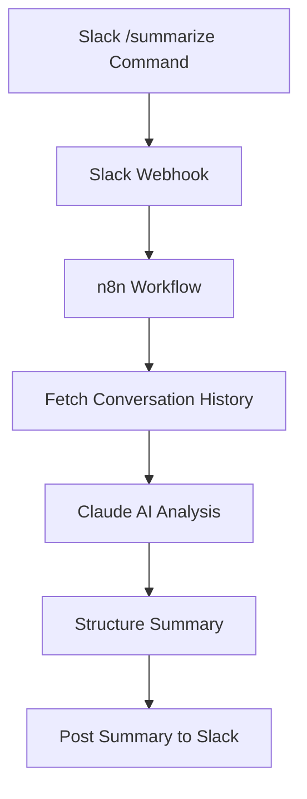

# ADR 001: MVP Slack Incident Summarization Bot

## Status

Accepted

## Context

On-call engineers need to communicate incident details to management and stakeholders in a clear, concise manner. Currently, this process is manual, time-consuming, and can lead to inconsistent reporting. Engineers must read through lengthy Slack investigation threads and manually extract key information.

We need a solution that can automate the extraction and summarization of incident information from Slack threads to:
1. Save engineers' time
2. Ensure consistent reporting
3. Improve communication with stakeholders

For the MVP phase, we want to focus on a Slack bot that can analyze conversation threads and generate summaries on demand.

## Decision

We will implement a Slack bot that responds to a `/summarize` command in incident investigation threads. The bot will:

1. Extract the conversation history from the thread
2. Analyze the conversation to identify:
   - Incident cause
   - Impact
   - Resolution steps
   - Timeline
3. Generate a concise summary suitable for management
4. Post the summary back to the thread

### Technical Architecture

### Technology Choices

1. **Workflow Automation**: n8n
   - Rationale: n8n provides built-in nodes for Slack integration and HTTP requests, making it easy to orchestrate the workflow
   - Implementation: Hosted in Docker for easy deployment and scaling

2. **AI Service**: Claude via AWS Bedrock
   - Rationale: Claude has strong capabilities for understanding conversation context and extracting structured information
   - Implementation: Integrated via AWS Bedrock for managed API access

3. **Deployment**: Docker Compose
   - Rationale: Simplifies local development and deployment
   - Implementation: Container setup for n8n and any additional required services

## Implementation Approach

1. **Slack App Configuration**
   - Create a Slack app with slash command permissions
   - Set up OAuth for accessing conversation history
   - Configure webhook endpoint for receiving commands

2. **n8n Workflow**
   - Create a workflow triggered by Slack webhook
   - Implement logic to fetch conversation history
   - Send conversation to Claude API with appropriate prompts
   - Format and post the summary back to Slack

3. **Claude Prompt Engineering**
   - Design prompts that instruct Claude to:
     - Identify key information in the conversation
     - Structure the output in a consistent format
     - Generate concise, management-friendly summaries
   - Iterate on prompts based on testing results

4. **Docker Compose Setup**
   - Configure n8n container
   - Set up environment variables for API keys and credentials
   - Ensure persistence for n8n workflows and data

## Consequences

### Advantages

1. **Time Savings**: Reduces the time engineers spend on creating incident summaries
2. **Consistency**: Provides a standardized format for incident reporting
3. **Scalability**: Can be extended to handle more complex analysis in future phases
4. **Ease of Deployment**: Docker Compose setup simplifies deployment and maintenance

### Limitations

1. **Context Limitation**: The MVP only analyzes Slack conversations without additional context from monitoring tools
2. **Manual Triggering**: Requires manual invocation of the `/summarize` command

### Future Considerations

1. **Integration with Monitoring Tools**: Future phases could incorporate data from New Relic and AWS
2. **Automated Triggering**: Could automatically generate summaries at key points in the incident lifecycle
3. **Knowledge Base**: Could build a repository of past incidents for reference and learning

## References

- [n8n Documentation](https://docs.n8n.io/)
- [Slack API Documentation](https://api.slack.com/)
- [AWS Bedrock Documentation](https://aws.amazon.com/bedrock/)